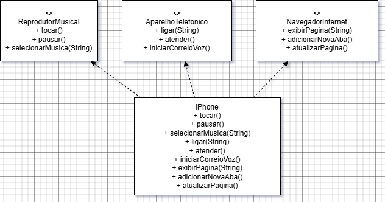

# 📱 Projeto iPhone - Modelagem UML e Implementação em Java

Este projeto representa a modelagem orientada a objetos do **iPhone**, com base no vídeo de lançamento original de 2007 da Apple. O objetivo foi **modelar as funcionalidades principais do dispositivo** utilizando **interfaces e uma classe concreta**, seguindo os princípios da **programação orientada a objetos (POO)** em Java.

---

## 🔧 Funcionalidades Modeladas

O iPhone foi modelado com três capacidades principais:

- 🎵 **Reprodutor Musical**
    - `tocar()`
    - `pausar()`
    - `selecionarMusica(String musica)`

- 📞 **Aparelho Telefônico**
    - `ligar(String numero)`
    - `atender()`
    - `iniciarCorreioVoz()`

- 🌐 **Navegador na Internet**
    - `exibirPagina(String url)`
    - `adicionarNovaAba()`
    - `atualizarPagina()`

Essas funcionalidades foram separadas em interfaces Java, e a classe `iPhone` implementa todas elas.


## 🧩 Diagrama UML

Abaixo está o diagrama UML representando a estrutura do projeto:




## 💻 Código Java

O projeto contém os seguintes arquivos `.java`:

- `ReprodutorMusical.java`
- `AparelhoTelefonico.java`
- `NavegadorInternet.java`
- `iPhone.java`

A classe `iPhone` implementa as três interfaces e define o comportamento esperado de cada método.

---

## 🚀 Como executar o projeto

1. Clone o repositório:
   ```bash
   git clone https://github.com/seu-usuario/seu-repositorio.git
   cd seu-repositorio
